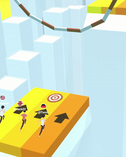

# 🎮 Game Development Portfolio

Welcome to my game development portfolio! Here, you’ll find a collection of GIFs showcasing some of the mobile games I've developed in the hyper-casual and hybrid-casual genres. All of the games are built using Unity (C#), focusing on providing smooth, engaging gameplay experiences.

This is a work-in-progress portfolio. Currently, I’ve included an overview of a few games through GIFs, and I plan to add more games along with their source code in the future.

## Development Process

Each game in this portfolio follows a clear process. Here are the main steps:

1. **Idea & Game Design Document (GDD)**:  
   Every game starts with thinking of new ideas that work well for hyper-casual or hybrid-casual genres. Once we have the idea, we make a document called the Game Design Document (GDD).

2. **Prototype & Testing**:  
   After the idea is clear, we build a quick version of the game (called a prototype) to test how it plays. We make changes based on the feedback we get to improve the game.

3. **Development & Art**:  
   During development, I write the code to make sure the game runs smoothly. I work closely with artists to add the game's graphics, 3D objects, and animations. The goal is to ensure the game looks great and is easy to play.

4. **Testing & Feedback**:  
   We test the game carefully to find any bugs or issues. I also check how players feel when they play it. We use this feedback to improve the game before launch.

5. **Launch & Release**:  
   Once the game is ready, we prepare it for release on platforms like Google Play and the App Store. I create marketing items like icons and CPI videos to help promote the game.

## Previous Games

| Icon | Game Title | Description | Gameplay GIF |
|------|------------|-------------|--------------|
| | **WWZERO: States Reborn** | Reclaim territories for the USA, starting from the last remaining state of Maine and progressing westward, facing increasingly challenging opponents. |  |
| | **Delivery Go!** | Use your skills to run your delivery business. start small, work up, and use your daily profit to expand, by hiring people and buying trucks! |  |
| | **Defense Battle** | Defense Battle is a strategy defense game. where you place warriors with shield, bow and sword fighting skills to protect your precious treasures. |  |
| | **Strapped Shooter** | Run to the helicopter and escape the zombies area! by expanding the rope length using rope balls. and defend yourself with the powerful guns. |  |
| | **Vehicles Upgrade** | Collect power-ups to level up and evolve into a more fast vehicle, and blow all obstacles facing you, and reach the finish line. |  |

       

Stay tuned for more updates! I’ll be adding new games and their source code soon.

### Acknowledgment

Honesty and collaboration are important to me, and I’d like to acknowledge the contribution of **Mohamed E.** who worked with me on some of the game mechanics and level design for several of these projects.
